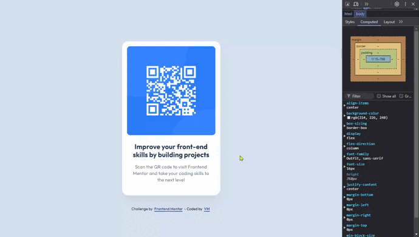

# Frontend Mentor - QR code component solution

This is a solution to the [QR code component challenge on Frontend Mentor](https://www.frontendmentor.io/challenges/qr-code-component-iux_sIO_H). Frontend Mentor challenges help you improve your coding skills by building realistic projects. 

◼️ [Screenshots](#screenshots-camera)

◼️ [Links](#links-link)

◼️ [Built with](#built-with-hammer_and_pick)

◼️ [Author](#author-beginner)

## Screenshots :camera:

### Links :link:

[Live site URL here](https://mendezpvi.github.io/fem-qr-code-component/) 👈

[Solution on Frontend Mentor](https://www.frontendmentor.io/solutions/qr-code-component-rpCIs7DtWB) 👈

## Built with :hammer_and_pick:

📌 Semantic HTML5 markup

📌 Mobile-first workflow

📌 CSS custom properties

📌 Flexbox

📌 Nesting CSS

## Author :beginner:

✨ Frontend Mentor - [@mendezpvi](https://www.frontendmentor.io/profile/mendezpvi)

✨ X-Twitter - [@mendezpvi](https://x.com/mendezpvi)